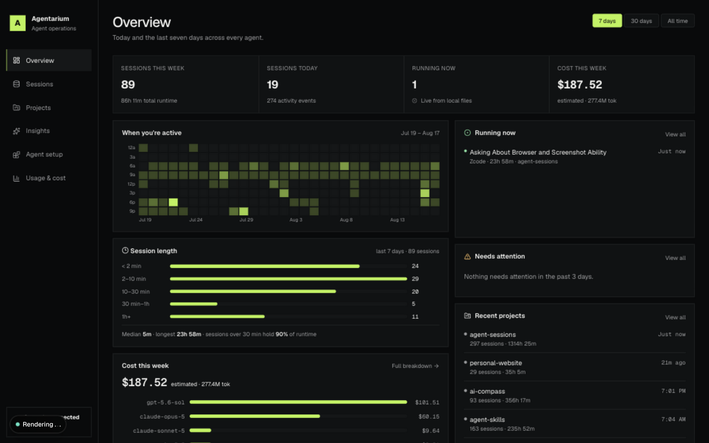
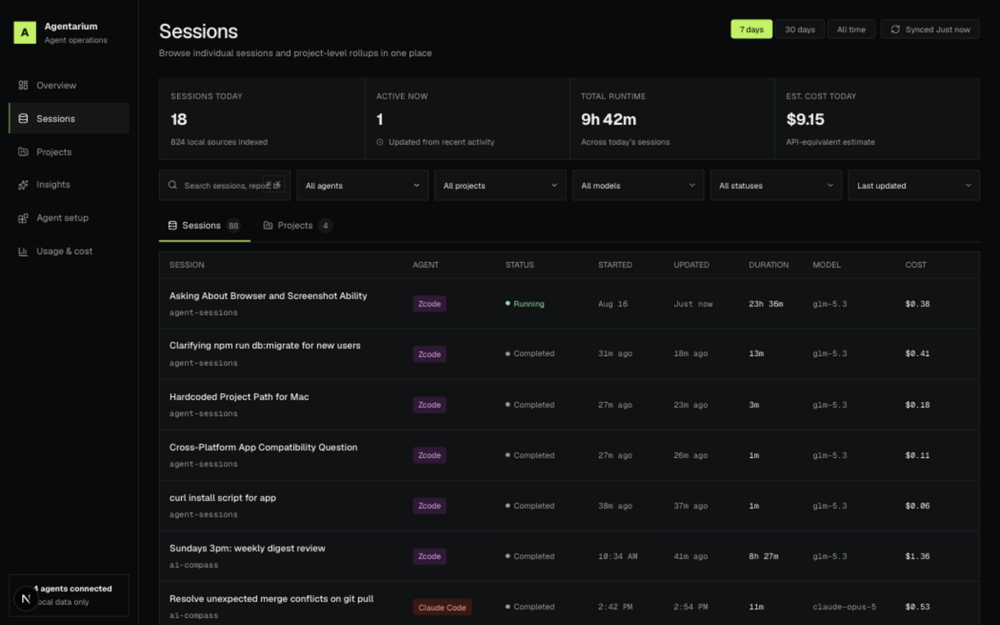
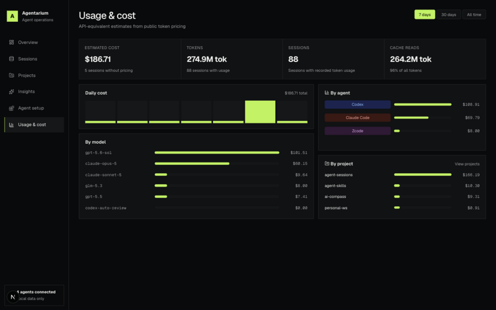
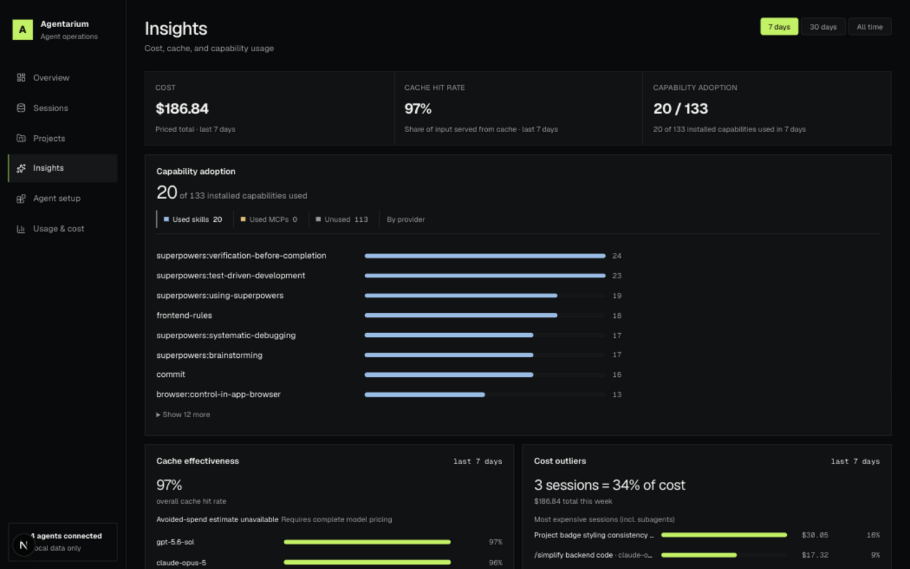
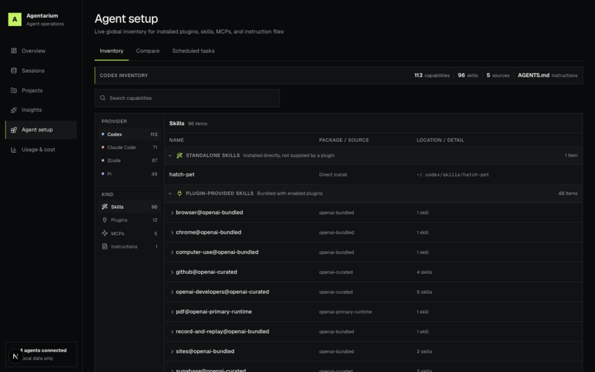

# Agentarium

Agentarium is a private, local-only operations dashboard for coding-agent sessions. It indexes metadata and sanitized activity from Codex, Claude Code, Zcode, and Pi into a local SQLite database. Detailed session pages read messages and tool payloads from local provider storage on demand — nothing is copied into Agentarium's database.

<a href="https://raw.githubusercontent.com/elite-flacco/agent-sessions/main/docs/screenshots/overview.png"></a>

## Requirements

- Node.js 20.9 or newer
- Local session histories from one or more supported agents

## Run locally

One-time setup after cloning:

```bash
npm ci
npm run collect
```

Then, whenever you want to use the dashboard:

```bash
npm run dev
```

Open [http://127.0.0.1:3000](http://127.0.0.1:3000). No database setup is needed — the schema is created automatically on first run. Agentarium refreshes dashboard data and picks up new local activity every 5 seconds while a page is open, so the setup commands do not need to be repeated. Use **Sync activity** for an immediate refresh, or run `npm run collect` again to import changes from the command line. After pulling updates, re-run `npm ci` if dependencies changed, and run `npm run db:migrate` if the update added migrations under `drizzle/`.

Optional: to keep collecting even when no dashboard page is open, run a watcher in a second terminal:

```bash
npm run collect:watch
```

Only one watcher can run at a time — a second `collect:watch` exits with a message instead of double-importing.

## Views

Overview, Sessions, Usage & Cost, Insights, and project briefings share a **7-day / 30-day / all-time** range toggle in the header that scopes that page's metrics to the same window.

### Overview

- Daily and weekly summaries, plus running, needs-attention, and recent-projects.
- Activity patterns: day × time-of-day activity heatmap, session-length histogram, and cost-at-a-glance.

### Sessions

- Summary cards, search, and provider/project/model/status filters, with switchable Sessions and Projects tables.
- Sessions sort by last update and nest subagent runs beneath their main session.
- Each session shows its model as one canonical name.

<a href="https://raw.githubusercontent.com/elite-flacco/agent-sessions/main/docs/screenshots/sessions.png"></a>

### Session detail

- Detailed view with session transcript, metadata and links between main and subagent sessions.

### Projects

- One workspace per project/repository — headline metrics, daily spend sparkline, per-agent session and cost split, activity feed, and more.
- Link to the GitHub repository when one is available.

### Usage & cost

- Cost, token, session, and cache-read metrics; daily cost history; and breakdowns by model, agent, and project.

<a href="https://raw.githubusercontent.com/elite-flacco/agent-sessions/main/docs/screenshots/usage.png"></a>

### Insights

- headline metrics for cost, cache hit rate, and capability adoption.
- Capability adoption tabs — Skills, MCPs, Not observed, By provider.

<a href="https://raw.githubusercontent.com/elite-flacco/agent-sessions/main/docs/screenshots/insights.png"></a>

### Agent setup

- Global inventory of plugins, skills, MCP servers, and instruction files for Codex, Claude Code, Zcode, and Pi.
- **Inventory**: a per-provider catalog.
- **Compare**: highlights what needs attention plus the full provider-by-provider matrix.
- **Scheduled tasks**: all recurring jobs from the coding agents — Codex automations, Claude scheduled tasks, and Zcode automations with humanized cron schedules, next run times, and run counts.

<a href="https://raw.githubusercontent.com/elite-flacco/agent-sessions/main/docs/screenshots/agent-setup.png"></a>

How the results are interpreted: [Agent setup](#agent-setup).

## Implementation Details

### Session statuses

Statuses come from provider lifecycle records, never guessed from inactivity alone.

| Status         | Meaning                                                                                                            |
| -------------- | ------------------------------------------------------------------------------------------------------------------ |
| Completed      | Explicit completion evidence.                                                                                      |
| Running        | Unfinished and updated within the last 10 minutes.                                                                 |
| Incomplete     | Unfinished and stale — no updates for 10 minutes. A trailing user message with no assistant completion lands here. |
| Interrupted    | An explicit abort or cancellation marker — nothing less.                                                           |
| Awaiting input | An unresolved Zcode `AskUserQuestion`; the session is waiting on you.                                              |
| Failed         | A genuine error, labeled with its reason — e.g. _Failed · Usage limit_, _Failed · Network error_.                  |

The Overview includes attention sessions — Awaiting input, Failed, and Interrupted — from today and the two previous calendar days.

### Costs

Costs are **API-equivalent estimates**; subscription plans don't bill per token.

- Tokens are priced against a checked-in table of public per-token rates with effective dates and source URLs. Pi sessions instead carry the provider's own recorded cost, shown as **Reported**.
- A model with no pricing entry shows **Unavailable** rather than a partial dollar figure.

Subagent rollups:

- A session's cost includes every subagent it spawned, at any depth. Detail pages break that out as _main_ vs. _subagents_, and each nested subagent row shows its own subtree total.
- One unpriced model anywhere in the tree makes the whole total unavailable — a main session can read **Unavailable** even when its own usage is priced.
- Dollar totals on `/usage`, the overview cost card, and the Insights period total count each session once, so subagents are never double-counted. The Insights expensive-session list credits a subagent tree to its topmost session, so heavily delegating sessions appear once with their whole tree's spend.

### Data sources

| Provider    | Local source                                                                                                        |
| ----------- | ------------------------------------------------------------------------------------------------------------------- |
| Codex       | `~/.codex/sessions/**/*.jsonl` and `~/.codex/state_5.sqlite` (or `~/.codex/sqlite/state_5.sqlite`)                  |
| Claude Code | `~/.claude/projects/**/*.jsonl`                                                                                     |
| Zcode       | `~/.zcode/cli/rollout/**/*.jsonl`, `~/.zcode/cli/agents/**/*.jsonl`, and `~/.zcode/cli/db/db.sqlite` when available |
| Pi          | `~/.pi/agent/sessions/**/*.jsonl`                                                                                   |

- Agentarium stores its normalized database at `data/agentarium.db`. Override with `AGENTARIUM_DATABASE_PATH=/absolute/path/agentarium.db`. The pre-rename `RELAY_DATABASE_PATH` variable and `data/relay.db` location are still honored, and a default-location `data/relay.db` is adopted (renamed) automatically on first run.
- Session titles prefer provider-authored values, falling back to the first meaningful user message.

### Agent setup

The **Agent setup** page reads global configuration live when `/agents` is opened; it is never persisted in Agentarium's database. This first version is global-only — project-level configuration is not included yet.

**Needs attention** evaluates every capability type across the three primary agents (Pi is included for context only):

- **Fix** — genuinely broken state: install files missing on disk, missing global instructions, or skills.sh-managed skills absent from one agent (they exist to be synced everywhere).
- **Review** — other partial installs and configuration or content drift. Identically named skills with different content are flagged as drift; line-ending differences are not. Deliberately disabled capabilities count as present (drift, not a missing install).
- The attention view also lists configuration warnings — malformed sources, stale plugin cache versions, skills.sh lockfile entries with no installed skill — and per-agent duplicate installs, distinguishing identical redundant copies from same-name copies with different content.
- Capabilities found on only one provider remain contextual in **Complete matrix** instead of being treated as errors.
- These labels are read-only heuristics; Agentarium never modifies agent configuration.

| Provider    | Global sources                                                                                                                             |
| ----------- | ------------------------------------------------------------------------------------------------------------------------------------------ |
| Codex       | `~/.codex/config.toml`, `~/.codex/skills`, configured plugin directories, and `~/.codex/AGENTS.md`                                         |
| Claude Code | `~/.claude/settings.json`, `~/.claude/plugins/installed_plugins.json`, `~/.claude/skills`, `~/.claude.json`, and `~/.claude/CLAUDE.md`     |
| Zcode       | `~/.zcode/cli/config.json`, `~/.zcode/cli/plugins/installed_plugins.json`, `~/.zcode/skills`, plugin directories, and `~/.zcode/AGENTS.md` |
| Pi          | `~/.pi/agent/settings.json`, `~/.pi/agent/extensions`, `~/.pi/agent/skills`, `~/.agents/skills`, and `~/.pi/agent/AGENTS.md`               |

How the inventory is interpreted:

- Standalone skills installed by the skills.sh CLI are identified from `~/.agents/.skill-lock.json`; locally linked skills, plugin-contributed skills, built-ins, and unknown sources are labeled separately.
- Broken skill links and plugins whose install directories are gone remain visible as unavailable, so the comparison can expose drift.
- Only an explicit disable reads as **Disabled**; otherwise a plugin reads as **Installed** with its state unknown. Codex per-skill disables apply on top of the plugin's state.
- Disabled capabilities appear only in Compare, where a deliberate disable is distinguished from a missing install. The Inventory view shows what is currently in effect, one provider and one kind at a time.
- Skills are grouped by management source — Standalone, Plugin-provided, Built-in, Marketplace, and Personal when present — each starting expanded and independently collapsible. Plugin-provided skills stay beneath their plugin's collapsible parent.
- Selecting a row shows its details, including the parent plugin and any duplicate installs.

The page shows only safe fields: capability name and type, enabled or installed status, packaging, provenance, source repository, and safe local paths. Global instruction Markdown is shown in full. MCP commands, arguments, environment variables, credentials, and raw configuration blocks are never shown.

## Commands

- `npm run dev` — start the loopback-only development server
- `npm run build && npm start` — build and run the production server
- `npm run collect` — incrementally import changed local files once
- `npm run collect:watch` — import once and watch existing sources for changes
- `npm run db:generate` — generate a versioned migration after schema changes
- `npm run db:migrate` — apply pending database migrations (a fresh install never needs this)
- `npm run verify` — lint, typecheck, formatting, tests, and production build
